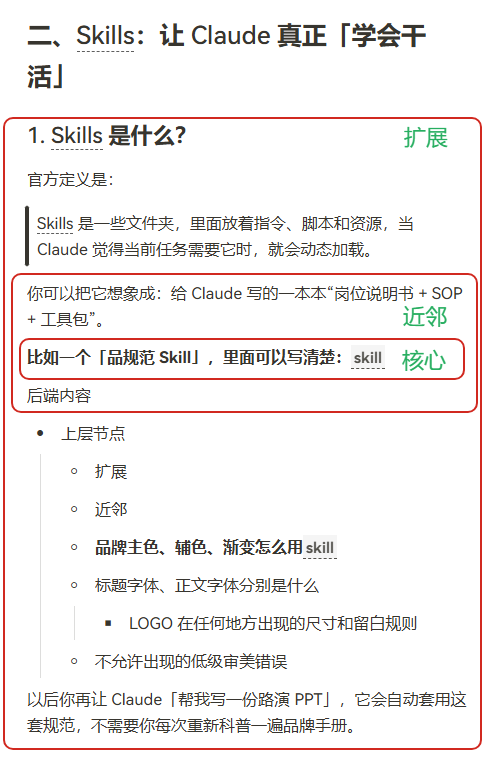
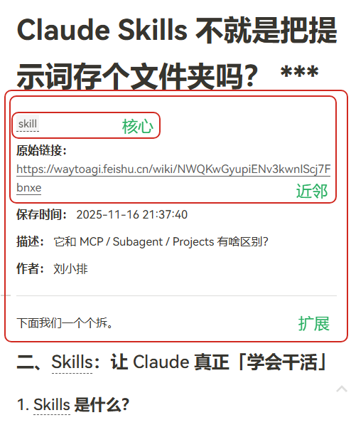
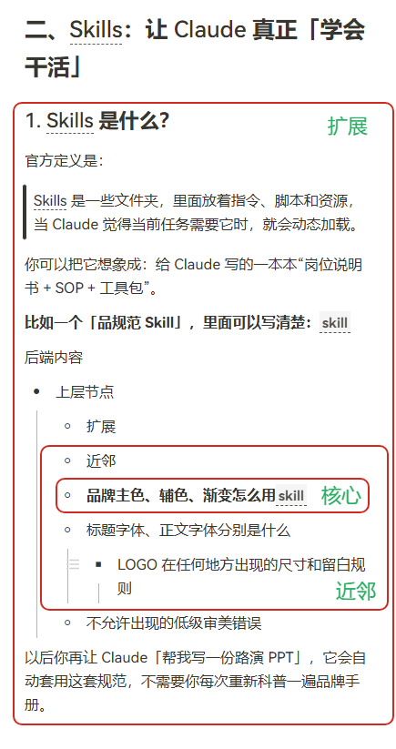

再约定一下规则，在所有情况下，显示内容均按原文显示和渲染。拖拽或编辑实时反映到原文变更。

- 核心：反链所在段落或列表项；
- 近邻：反链所在段落加上前后段落，或者反链所在列表项加上前后列表项，如果前后列表项包含父节点则涵盖整个父节点内容；
- 扩展：以反链块为中心，向上扩展到最近一个标题（含标题），向下扩展到最近一个标题（不含），作为展示范围，如果没有小标题则向上扩展到文档开头，向下扩展到结尾
- 全文：全文

请根据思源文档id 20251116213835-oqv3yl2 中的不同场景，通过mcp工具进行验证。

示例1：反链在普通文本块

示例2：反链在文档开头段落

示例3：反链在列表项

